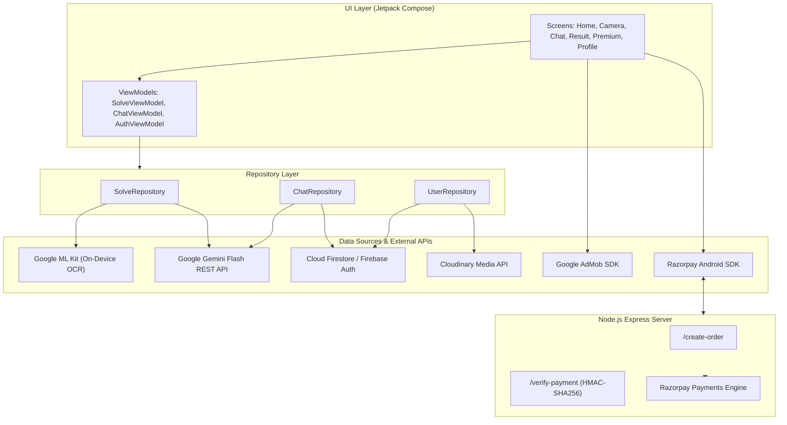

# 📚 AI Study Solver (AI Study Helper)

<p align="center">
  
  
  
  
  
  
  
</p>

---

## 🌟 Overview

**AI Study Solver** is an intelligent, full-stack Android educational assistant built with **Jetpack Compose**, **Google Gemini AI**, and **Google ML Kit OCR**. The app empowers students to snap photos of handwritten or printed questions, transcribe them on-device, intelligently clean up OCR artifacts, and receive instant, comprehensive step-by-step solutions and explanations.

Beyond static question solving, the app features an interactive **AI Tutor Chat**, customizable **Dark/Light Theming**, cloud image hosting via **Cloudinary**, user authentication via **Firebase**, a gamified **Coin Reward economy** powered by **Google AdMob**, and a complete **Razorpay subscription gateway** powered by a lightweight **Node.js Express** backend.

---

## ✨ Key Features

### 📸 1. Instant Camera & OCR Scanner
- **CameraX Integration:** Fast camera preview with torch/flash toggle, tap-to-focus, and fluid capture animations.
- **Gallery Import:** Pick existing images, diagrams, or homework worksheets directly from the device gallery.
- **On-Device ML Kit OCR:** Zero-latency text extraction using Google Play Services Text Recognition without requiring an initial network round-trip.

### 🧠 2. Intelligent Gemini AI Problem Solver
- **Self-Healing OCR Transcription:** Custom system prompts enable Google Gemini Flash (`gemini-flash-latest`) to intelligently correct typos, misread mathematical symbols, and distorted character sequences.
- **Structured Explanations:** Breaks down complex problems into:
  - **Cleaned Question:** Restatement of the user's question in clear English.
  - **Step-by-Step Solution:** Formula derivations, reasoning, and verified final answers.

### 💬 3. Interactive AI Tutor Chat
- **Multi-Turn Contextual Dialog:** Ask follow-up questions, request simpler explanations, or test knowledge with practice problems.
- **Conversation Management:** Create new chats, rename sessions, delete conversations, or browse conversation history with instant keyword search.
- **Response Regeneration:** Re-query the Gemini AI engine with one click if an alternative explanation is preferred.

### 🔐 4. Complete Authentication Suite
- **Firebase Auth:** Email/password registration and sign-in with extensive error handling (account not found, wrong password, password reset).
- **Google One-Tap / OAuth Sign-In:** Frictionless single-sign-on using Google Play Services credentials.
- **Cloud Firestore User Profiles:** Real-time synchronization of user profiles, saved questions, chat history, and subscription status.

### 💰 5. Monetization & Coin Reward Economy
- **Google AdMob Integration:**
  - **Banner Ads:** Non-intrusive placement on dashboard and study screens.
  - **Interstitial Ads:** Natural transition breaks after solutions are computed.
  - **Rewarded Video Ads:** Allows free-tier students to watch short sponsored videos to earn coins and unlock premium solutions.

### 💳 6. Razorpay Premium Subscriptions
- **Subscription Plans:** Monthly and Yearly subscription options offering ad-free learning, unlimited instant solutions, and priority AI processing.
- **Secure Node.js Backend:** Express server creating signed Razorpay orders (`/create-order`) and verifying cryptographic signatures with HMAC-SHA256 (`/verify-payment`).
- **Real-Time Entitlement Updates:** Premium status automatically updates in Firestore upon verified transaction.

### 🎨 7. Modern UI / UX Architecture
- **100% Jetpack Compose:** Declarative UI with Material 3 design tokens.
- **Dynamic Theming:** Seamless switching between Deep Space Dark Mode and Clean Light Mode.
- **Cloudinary & Glide:** Effortless profile picture uploads via Cloudinary Android SDK and high-performance asynchronous rendering with Glide Compose.

---

## 🏛️ Application Architecture

The Android application follows standard Android architecture guidelines (**MVVM + Repository Pattern**) with **Kotlin Coroutines** and **StateFlow** for reactive, unidirectional data flow (UDF).



---

## 🛠️ Technology Stack

| Domain | Technology / Library | Description |
| :--- | :--- | :--- |
| **Language** | Kotlin 2.0 | Modern, concise, type-safe programming language |
| **UI Framework** | Jetpack Compose (BOM 2024.10) | Declarative UI toolkit with Material Design 3 |
| **Architecture** | MVVM + Repository Pattern | Clean separation of UI, presentation, and data layers |
| **Concurrency** | Kotlin Coroutines & StateFlow | Reactive, non-blocking asynchronous state handling |
| **Camera & Vision** | CameraX & Google ML Kit | Live camera feed and on-device Latin text recognition |
| **AI Engine** | Google Gemini API (`gemini-flash-latest`) | High-speed LLM reasoning and multimodal problem solving |
| **Networking** | Retrofit 2 + OkHttp3 + Gson | Type-safe REST client for Gemini & Payment backend |
| **Cloud & Auth** | Firebase (Auth, Firestore, Analytics) | User authentication, database synchronization |
| **Image Hosting** | Cloudinary Android SDK + Glide Compose | Profile image uploads and optimized image caching |
| **Monetization** | Google Mobile Ads (AdMob) | Banner, interstitial, and rewarded video ads |
| **Payments** | Razorpay Android SDK | In-app checkout for subscriptions |
| **Backend Server** | Node.js, Express, Razorpay SDK, Crypto | Order creation and cryptographic signature verification |

---

## 📁 Repository Structure

```
AI-Study-Helper-App/
├── app/                                # Android Application Module
│   ├── src/
│   │   ├── main/
│   │   │   ├── AndroidManifest.xml     # App permissions, activities, providers
│   │   │   ├── java/com/aistudy/solver/
│   │   │   │   ├── MainActivity.kt     # App entry point & Razorpay callback handler
│   │   │   │   ├── StudySolverApp.kt   # Application class
│   │   │   │   ├── data/
│   │   │   │   │   ├── api/            # Retrofit interfaces (GeminiApi, PaymentApi)
│   │   │   │   │   ├── model/          # Data classes (Chat, Gemini, Payment, User)
│   │   │   │   │   └── repository/     # Data repositories (Solve, Chat, User)
│   │   │   │   ├── navigation/         # Compose Destinations & NavHost setup
│   │   │   │   ├── ui/
│   │   │   │   │   ├── screens/        # Screen composables (Home, Camera, Chat, etc.)
│   │   │   │   │   ├── theme/          # Typography, Color schemes, MaterialTheme
│   │   │   │   │   └── viewmodel/      # Auth, Chat, and Solve ViewModels
│   │   │   │   └── utils/              # AdMob, Cloudinary, Camera & OCR helpers
│   │   │   └── res/                    # Drawables, layouts, mipmaps, strings
│   ├── build.gradle.kts                # App-level build script & dependencies
│   └── proguard-rules.pro              # ProGuard configuration for release builds
├── server/                             # Node.js Payment Backend
│   ├── index.js                        # Express server with /create-order & /verify-payment
│   └── package.json                    # Server dependencies (express, razorpay, cors)
├── gradle/
│   └── libs.versions.toml              # Version catalog for dependencies and plugins
├── build.gradle.kts                    # Root build configuration
├── settings.gradle.kts                 # Repository and plugin management
└── README.md                           # Documentation
```

---

## 🚀 Getting Started

### Prerequisites

1. **Android Studio**: Android Studio Koala / Ladybug or newer.
2. **JDK**: Java Development Kit 11 or higher.
3. **Android Device / Emulator**: Running Android 7.0 (API level 24) or higher with Google Play Services.
4. **Node.js**: Node.js 18+ and npm installed (for the payment server).

---

### Step 1: Clone the Repository

```bash
git clone https://github.com/SorathiyaDhruvin/AI-Study-Helper-App.git
cd AI-Study-Helper-App
```

---

### Step 2: Configure Firebase

1. Go to the [Firebase Console](https://console.firebase.google.com/) and create a project.
2. Add an Android app with package name `com.aistudy.solver`.
3. Enable **Email/Password** and **Google Sign-In** under **Authentication > Sign-in method**.
4. Enable **Cloud Firestore** and set your read/write rules.
5. Download `google-services.json` and place it in the `app/` folder:
   ```
   app/google-services.json
   ```

---

### Step 3: Configure Android App Constants

Create a `Constants.kt` file in `app/src/main/java/com/aistudy/solver/utils/Constants.kt` with your own credentials:

```kotlin
package com.aistudy.solver.utils

object Constants {
    // Google Gemini API
    const val GEMINI_API_KEY = "YOUR_GEMINI_API_KEY"

    // Razorpay Credentials
    const val RAZORPAY_KEY_ID = "rzp_test_YOUR_KEY_ID"
    const val BACKEND_URL = "http://10.0.2.2:3000/" // Use 10.0.2.2 for Android Emulator or your local IP for physical devices

    // Cloudinary Credentials (for profile pictures)
    const val CLOUDINARY_CLOUD_NAME = "YOUR_CLOUD_NAME"
    const val CLOUDINARY_API_KEY = "YOUR_CLOUDINARY_API_KEY"
    const val CLOUDINARY_API_SECRET = "YOUR_CLOUDINARY_API_SECRET"

    // Default Avatar
    const val DEFAULT_PROFILE_IMAGE = "https://res.cloudinary.com/demo/image/upload/avatar.png"

    // Google AdMob Ad Unit IDs (Test Ad IDs for development)
    const val BANNER_AD_ID = "ca-app-pub-3940256099942544/6300978111"
    const val INTERSTITIAL_AD_ID = "ca-app-pub-3940256099942544/1033173712"
    const val REWARDED_AD_ID = "ca-app-pub-3940256099942544/5224354917"
}
```

> [!NOTE]
> When testing on a physical Android device, change `10.0.2.2` in `BACKEND_URL` to your computer's local Wi-Fi IP address (e.g., `http://192.168.1.100:3000/`).

---

### Step 4: Run the Backend Payment Server

Open a terminal and start the Express payment server:

```bash
cd server
npm install
node index.js
```

The server will start listening on port `3000`:
```
Server is running on port 3000
```

---

### Step 5: Build & Run the Android App

1. Open the project in **Android Studio**.
2. Let Gradle sync project dependencies.
3. Select an emulator or connected physical Android device.
4. Click **Run** (`Shift + F10`) or execute:
   ```bash
   ./gradlew installDebug
   ```

---

## 📡 Backend API Endpoints

The accompanying Node.js backend handles secure transaction flows:

### 1. Create Payment Order
- **Route:** `POST /create-order`
- **Request Body:**
  ```json
  {
    "amount": 500,
    "currency": "INR"
  }
  ```
- **Response:**
  ```json
  {
    "success": true,
    "order_id": "order_EKwxwAgIt4KOzs",
    "amount": 500,
    "currency": "INR"
  }
  ```

### 2. Verify Payment Signature
- **Route:** `POST /verify-payment`
- **Request Body:**
  ```json
  {
    "razorpay_order_id": "order_EKwxwAgIt4KOzs",
    "razorpay_payment_id": "pay_29QQoUBi66xm2f",
    "razorpay_signature": "9ef4705b64f32e8bb39493597138254e225b349d151ce04e587730eac80d232b"
  }
  ```
- **Response:**
  ```json
  {
    "success": true,
    "message": "Payment verified successfully"
  }
  ```

---

## 📱 Screen Breakdown

| Screen | Description |
| :--- | :--- |
| **Splash & Onboarding** | Animated entrance screen initializing settings, Firebase credentials, and theme preferences. |
| **Authentication** | Clean Material 3 login and signup forms with password toggle and Google One-Tap authentication. |
| **Home Dashboard** | Overview displaying user coins, recent solved questions, search history bar, and quick actions. |
| **Camera Scanner** | CameraX viewfinder with bounding guide, flash toggle, and direct gallery image picker. |
| **Solution & Results** | Formatted solution display with blur locks for free users, unlocked via rewarded ads or Pro membership. |
| **AI Tutor Chat** | Interactive Markdown chat interface supporting real-time problem exploration and message regeneration. |
| **Profile & Settings** | User statistics, Cloudinary photo upload, dark/light theme switch, and account preferences. |
| **Premium Upgrade** | Modern subscription plan selector (Monthly / Yearly) integrated with Razorpay checkout. |

---

## 🛡️ Security & Best Practices

- **API Keys Protection:** API keys and sensitive tokens are separated from source control using `.gitignore` and `Constants.kt`.
- **Payment Verification:** Razorpay payment signatures are validated server-side using cryptographic HMAC-SHA256 hashes before granting premium privileges.
- **Coroutines & Safety:** Network requests and image processing tasks are dispatched safely via `Dispatchers.IO` to ensure smooth 60fps UI rendering.
- **Fail-Safe OCR:** Gemini prompt templates handle noisy or garbled OCR text gracefully by attempting intelligent reconstruction before generating solutions.

---

## 🤝 Contributing

Contributions are welcome! If you would like to contribute:
1. Fork the Project.
2. Create your Feature Branch (`git checkout -b feature/AmazingFeature`).
3. Commit your Changes (`git commit -m 'Add some AmazingFeature'`).
4. Push to the Branch (`git push origin feature/AmazingFeature`).
5. Open a Pull Request.

---

## 📄 License

This project is licensed under the [MIT License](LICENSE).

---

## 👨‍💻 Author

**Sorathiya Dhruvin**
- GitHub: [@SorathiyaDhruvin](https://github.com/SorathiyaDhruvin)
- Project Repository: [AI-Study-Helper-App](https://github.com/SorathiyaDhruvin/AI-Study-Helper-App)
